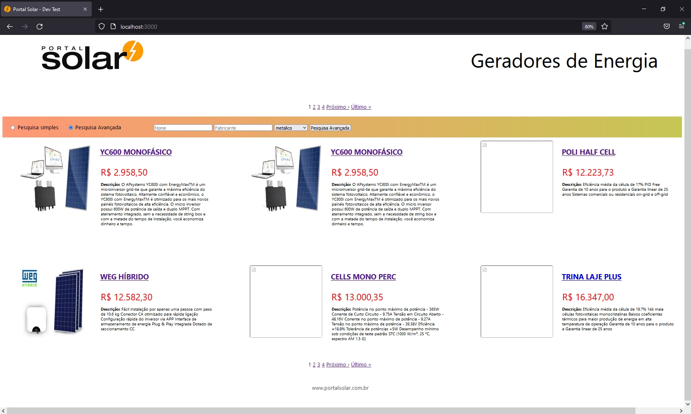
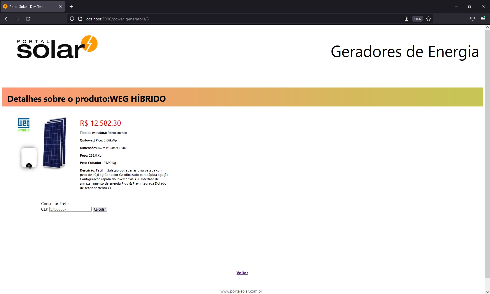
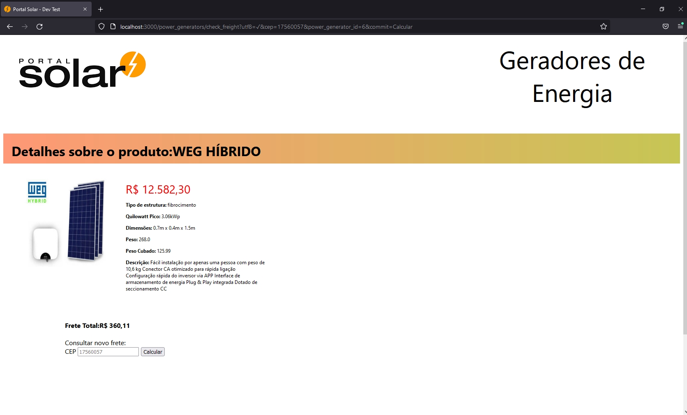
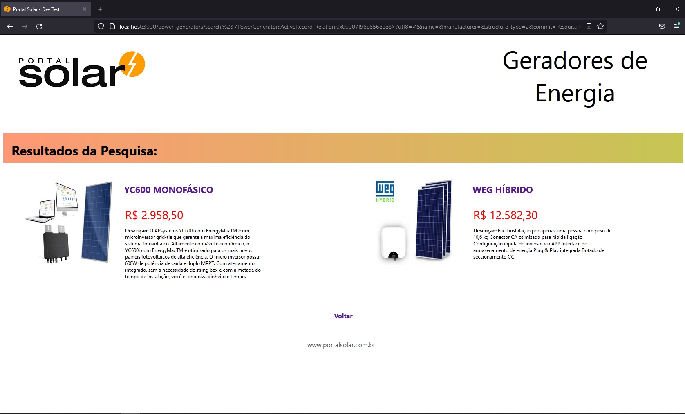
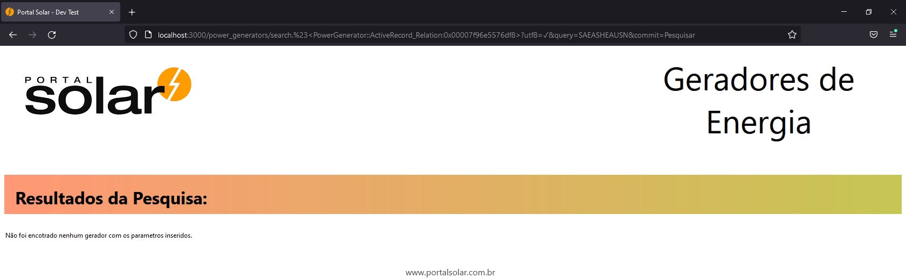

<h1 align="center">Buscador de Geradores de Energia Solar </h1>

   

____
### 
 Tabela de Conteúdos 🗺️: 

  🔹	[Descrição do projeto](#descrição-do-projeto)  
  🔹	[Funcionalidades](#funcionalidades) 
  🔹	[Gems utilizadas](#gems-utilizadas) 
  🔹	[Como instalar a aplicação](#como-instalar-a-aplicação) 
  🔹	[Configurando o banco de dados](#configurando-o-banco-de-dados) 
  🔹	[Layout da aplicação](#layout-da-aplicação) 
  🔹	[Ideias para implementações futuras](#ideias-para-implementações-futuras) 

  #### 
 Descrição do projeto 

___
  Uma plataforma que permite a visualização e busca, de forma simples ou avançada, de geradores de energia de um e-commerce de geradores, bem como consultar o valor do frete com base no CEP.

  #### 
 Funcionalidades da aplicação 

___

  - [X] Geradores ordenados pela hierarquia: Preço → Nome → Quilowatt Pico (kWp)
  - [X] Lista de geradores organizada em páginas, contendo grupos de no máximo 6  por página.
  - [x] O peso cubado de um gerador é calculado e salvo automaticamente.
  - [X] Usuário pode buscar geradores através de uma pesquisa simples de um parâmetro ou uma pesquisa avançada com mais opções de parâmetros.
  - [X] Usuário pode inserir cep para verificar o custo de frete de um gerador.
  - [x] Calculo do frete otimizado para buscar o menor custo de frete entre o Peso líquido e Peso Cubado.

 #### 
 Linguagens, Gems e Frameworks utilizados 🛠️⚙️ : 

___
- [Ruby 2.6.3](https://ruby-doc.org) - Linguagem utilizada
- [Rails 5.2](https://guides.rubyonrails.org) - Framerwork utilizado para desenvolver o projeto
- [Docker](https://docs.docker.com) - Utilizado para modularização da aplicação
- [Rspec](https://github.com/rspec/rspec-rails) - Utilizado para os testes da aplicação
- [Capybara](https://github.com/teamcapybara/capybara#using-capybara-with-rspec) -Auxilia o rspec durante os testes
- [Pry-byebug](https://github.com/deivid-rodriguez/pry-byebug) - Utilizada para debugar o código
- [Shoulda-Matchers](https://github.com/thoughtbot/shoulda-matchers) - Utilizada para facilitar testes de validações de models
- [Kaminari](https://github.com/kaminari/kaminari)- Utilizada para fazer a paginação da aplicação
- [Faraday](https://lostisland.github.io/faraday/)- Utilizada para comunicações de API

####  
 Como instalar a aplicação 🔌: 

___

Clone o repositório em seu computador: 

    $ git clone  git@github.com:jonathandeoliveira/portal-solar-dev-test.git

######  
 Preparando o ambiente: 

Instale as depencedias do sistema

    $ bundle install

Será necessário utilizar o docker para nos fornecer postgresql para conectarmos ao banco de dados, execute o comando:

    $ docker-compose up

#### Configurando banco de dados 💾:
___

Execute o comando seed no seu console para popular o banco de dados:

    $ bundle exec rails db:create db:migrate db:seed

###### Inicie o servidor:

    $ bundle exec rails server

###### Rodando os testes:

    $ bundle exec rspec

#### Layout da aplicação 🔭:
___
###### Página inicial:
  

###### Detalhes de um gerador:
  
  

###### Página de busca:
  
  

### Ideias para implementações futuras 📖:
___
* Utilização da Gem FriendlyId para urls personalizadas
* Melhorar o front-end da aplicação
* Adicionar mais parâmetros no sistema de busca avançada
* Implementação de frete através de matriz de distância

### Contribuintes 👨‍💻👩‍💻 : 

| [ Jonathan de Oliveira Gonçalves](https://github.com/jonathandeoliveira) |
| :---: 